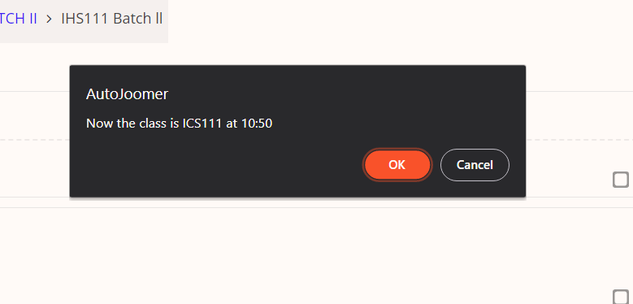

[![Contributors][contributors-shield]][contributors-url]
[![Forks][forks-shield]][forks-url]
[![Stargazers][stars-shield]][stars-url]
[![Issues][issues-shield]][issues-url]
[![MIT License][license-shield]][license-url]
[](https://github.com/vishal-lokare/AutoJoomer)

[contributors-shield]: https://img.shields.io/github/contributors/vishal-lokare/AutoJoomer.svg?style=for-the-badge
[contributors-url]: https://github.com/vishal-lokare/AutoJoomer/graphs/contributors

[forks-shield]: https://img.shields.io/github/forks/vishal-lokare/AutoJoomer.svg?style=for-the-badge
[forks-url]: https://github.com/vishal-lokare/AutoJoomer/network/members

[stars-shield]: https://img.shields.io/github/stars/vishal-lokare/AutoJoomer.svg?style=for-the-badge
[stars-url]: https://github.com/vishal-lokare/AutoJoomer/stargazers

[issues-shield]: https://img.shields.io/github/issues/vishal-lokare/AutoJoomer.svg?style=for-the-badge
[issues-url]: https://github.com/vishal-lokare/AutoJoomer/issues

[license-shield]: https://img.shields.io/github/license/vishal-lokare/AutoJoomer?style=for-the-badge
[license-url]: https://github.com/vishal-lokare/AutoJoomer/blob/main/LICENSE


<p align="center">
  <a href="https://github.com/vishal-lokare/AutoJoomer/"></a><br>
  <a href="https://github.com/vishal-lokare/AutoJoomer/"><b>AutoJoomer</b></a>
  <br><br><hr>  
  <p align="center">
  Maintainers-<br><br>
  </p>
  <p align="center">
  <table align='center' rules='none'>
    <tr align='center'>
      <td>
        <a href="https://github.com/vishal-lokare"></a> 
      </td>
      <td>
         <a href="https://github.com/freak-10"></a> 
      </td> 
      <td>
        <a href="https://github.com/karynaur"></a>
      </td> 
      <td>
        <a href="https://github.com/tomid9999"></a> 
      </td> 
      <td>
        <a href="https://github.com/nikhil9302"></a> 
      </td> 
    </tr>
    <tr>
      <td>
        <a href="https://github.com/vishal-lokare">vishal-lokare</a>
      </td> 
      <td>
        <a href="https://github.com/freak-10">freak-10</a>
      </td>  
      <td>
        <a href="https://github.com/karynaur">karynaur</a>
      </td>  
      <td>
        <a href="https://github.com/tomid9999">tomid9999</a>
      </td>  
      <td>
        <a href="https://github.com/nikhil9302">nikhil9302</a>
      </td>
    </tr>  
  </table>
  </p>

  <br>
  <br>
</p>
 <p align="center">
  Amazing contributors-<br><br>
  </p>
   <table align='center' rules='none'>
    <tr align='center'>
       <td>
         <a href="https://github.com/Abhijit25Mishra"></a> 
      </td>
      <td>
         <a href="https://github.com/nogi2k2"></a> 
      </td> 
      <td>
         <a href="https://github.com/aditivibgyor"></a> 
      </td> 
  </tr>
  <tr>
     <td>
        <a href="https://github.com/Abhijit25Mishra">Abhijit25Mishra</a>
      </td>
      <td>
        <a href="https://github.com/nogi2k2">nogi2k2</a>
      </td> 
     <td>
        <a href="https://github.com/aditivibgyor">aditivibgyor</a>
      </td> 
  </tr>
  </table>

    

# AutoJoomer
AutoJoomer is an Open Source browser extension that automatically joins classes for you on time (IIIT Kottayam 2022). Classes include lab and coding classes; Data fetched from hosted database, updated according to timetable. Currently available as a Chrome extension.

## Getting Started
Three-pointers to get you started:
* <p><a href="https://github.com/vishal-lokare/AutoJoomer/blob/main/CONTRIBUTING.md">Contributing.md</a></p>
* <p><a href="https://github.com/vishal-lokare/AutoJoomer/blob/main/LICENSE">License</a></p>
* <p><a href="https://github.com/vishal-lokare/AutoJoomer/tree/main/screenshots">Screenshots</a></p>


## Installation
1. Download all the files to a folder either by the "Download as ZIP" button or by cloning the repo.
<p align='center'></p>

2. Open your browser, navigate to "Extensions" panel -> "Manage Extensions".
3. Enable "Developer Mode" in the top-right.

<p align='center'></p>

4. Click on "Load Unpacked" and select the folder where you downloaded/cloned the files.
5. Navigate to "Extensions" panel -> click on "AutoJoomer".
6. Set the required values, click "SAVE", and restart your browser / reload the extension.

<p align='center'></p>

## How to stay updated
To stay up-to-date with the latest version hosted on github, while being in the same directory where the downloaded files are, run
```
git pull
``` 
in the terminal and restart your browser / reload the extension.

OR

Repeat the installation process again.

## How to use
1. Open your browser.
2. If values are not set, error will be displayed. In this case, set the values in "AutoJoomer" popup in "Extensions" panel.
3. In case you open your browser after a class has already started, the extension will automatically add you to that class as well, as the class started in the last hour. If "confirmation before joining class" is selected, the extension will show an alert as shown below:


4. <p>The extension will stop working when the browser is closed OR the day is over.</p>
5. <p>And that's it, now you are good to go!</p>

## Tech Stack Used
* HTML
* CSS
* JavaScript
* Firebase (RTDB)

## Contributing 
<p>Please let us know if you encounter a bug by filing an <a href="https://github.com/vishal-lokare/AutoJoomer/issues">issue.</a> We appreciate all contributions. If you are planning to contribute back bug-fixes, please claim the issue in the issues tab. If you plan to contribute new features, utility functions, or extensions to the core, please first open an issue and discuss the feature with us. Sending a PR without discussion might end up resulting in a rejected PR because we might be taking the core in a different direction than you might be aware of. To learn more about making a contribution to AutoJoomer, please see our <a href="https://github.com/vishal-lokare/AutoJoomer/blob/main/CONTRIBUTING.md">Contribution page</a></p>

## Communication
* <p>Discord: Hop on in our discord server - <a href="https://discord.gg/spzaqNkNkU"></a>, we will be happy to have you on board.</p>
* <p>GitHub Issues: Bug reports, feature requests, install issues etc.</p>


## Future Updates
<p>-> Search a student's name with roll number or vice-versa.</p>
<p>-> Publish extension in the Chrome Web Store.</p>
<p>-> Leave a class automatically after a certain period of time(Optional feature).</p>
<p>-> Rejoin classes automatically.</p>

## License
AutoJoomer is distributed under the Apache 2.0 license

